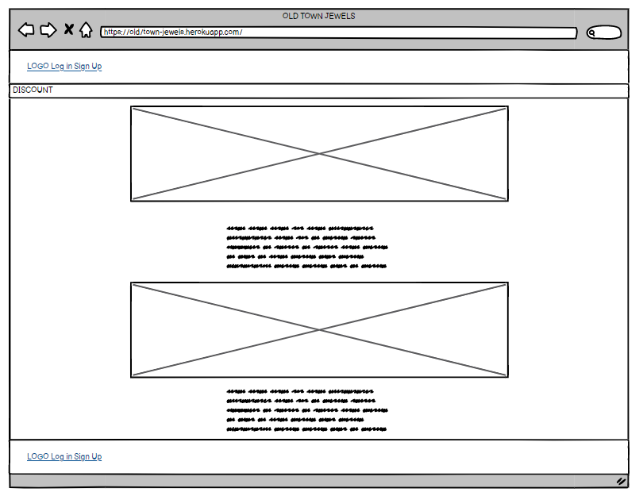
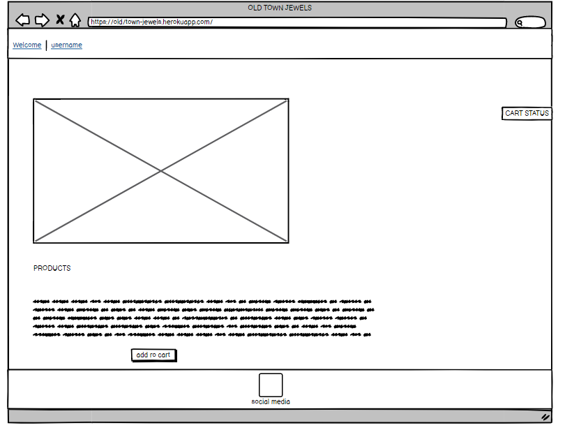
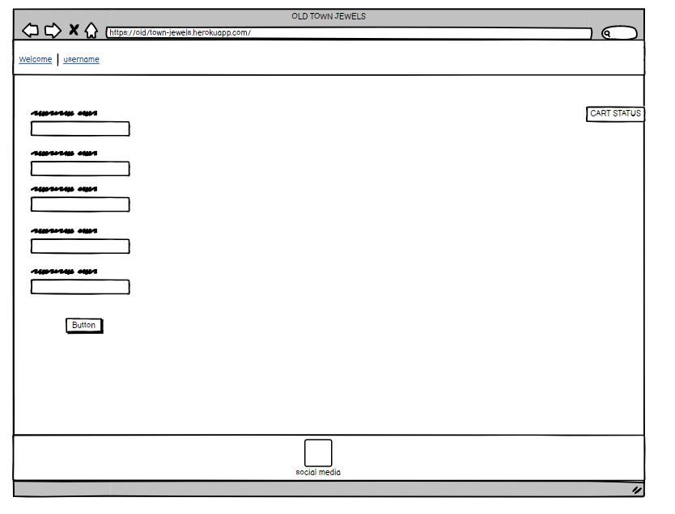
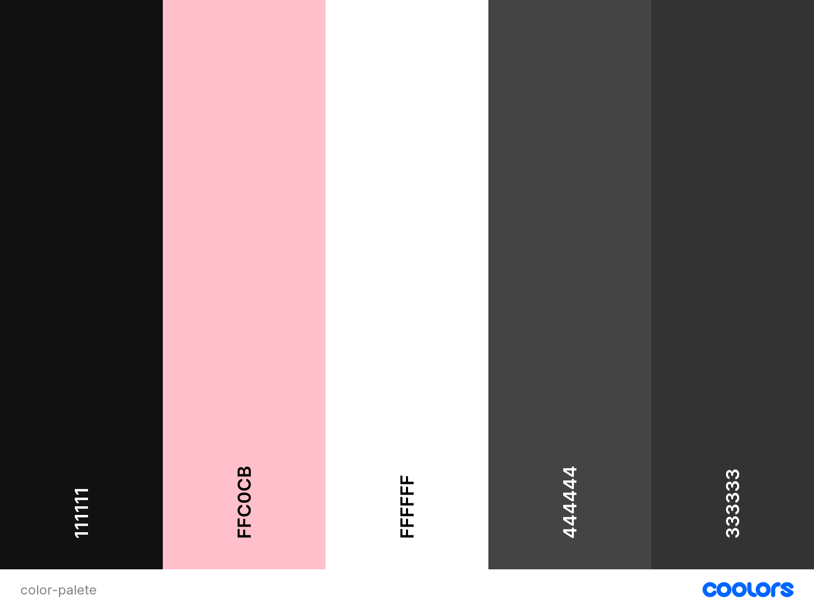
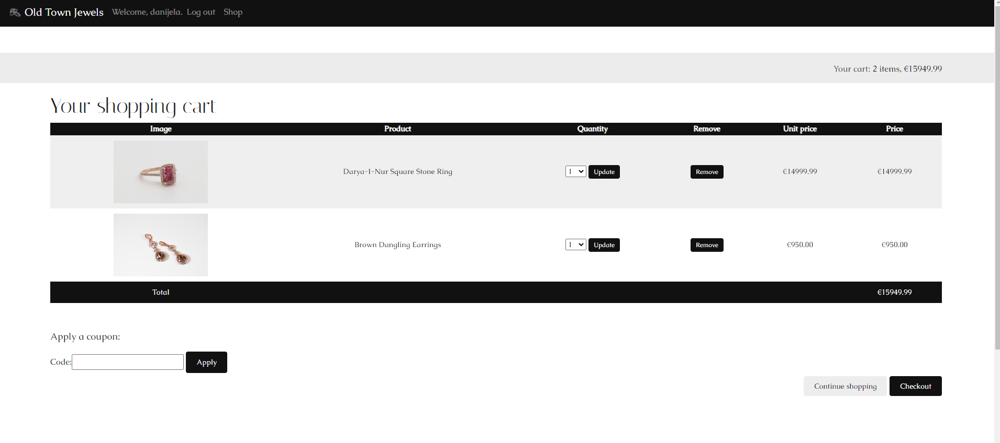
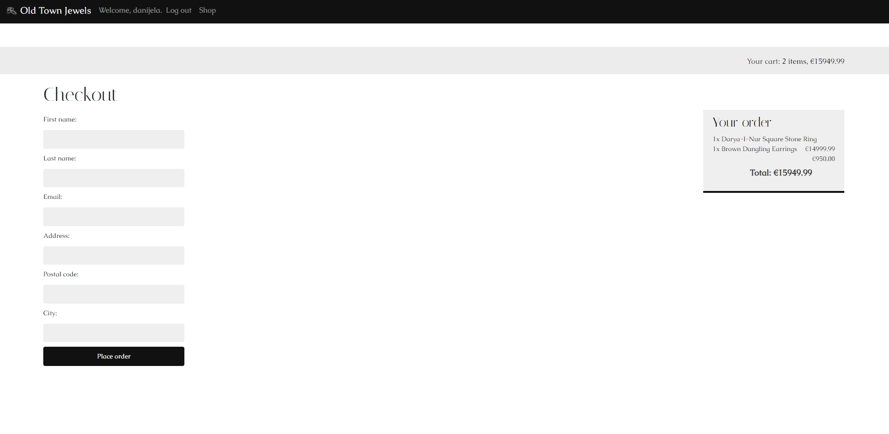
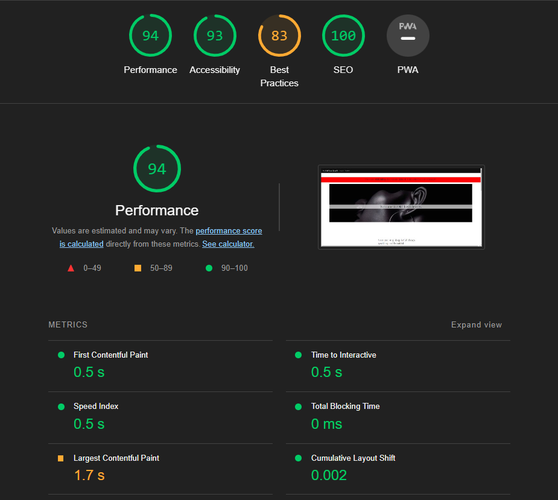
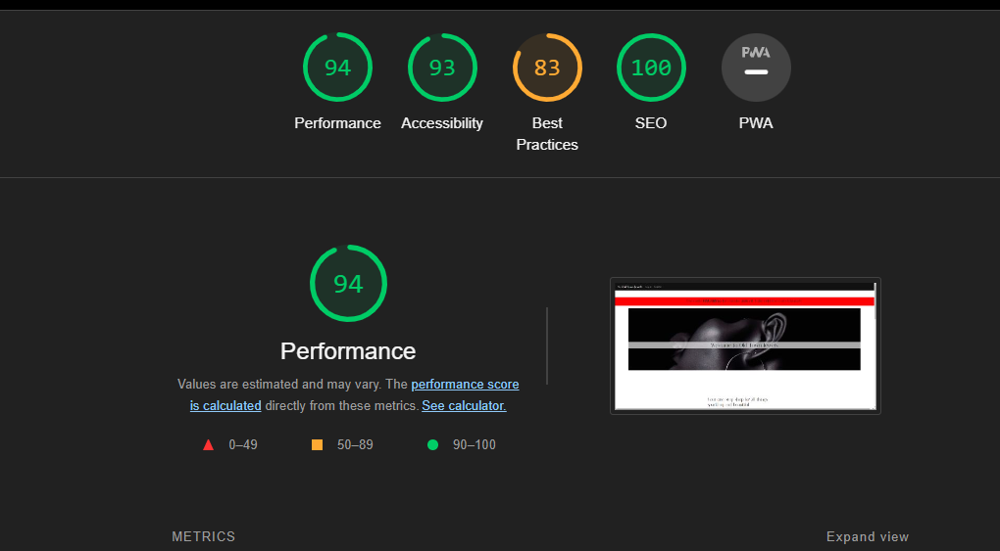

# old-town-jewels
# About
Old Town Jewels is an online jewellery store built using the Django web framework. It was developed as a part of a Fullstack course with Code Institute.

The store offers a wide variety of beautiful and unique jewellery pieces, including rings, earrings, necklaces, and more. Customers can browse the store's inventory, add items to their cart, and complete their purchase securely through the website.

Old Town Jewels is designed to be user-friendly and easy to navigate. The store features a clean and modern design, with high-quality product photos and detailed product descriptions to help customers make informed purchasing decisions.

Whether you're looking for a special piece of jewellery for yourself or a gift for someone else, Old Town Jewels has something for everyone. We hope you enjoy shopping with us!

[View the live project here](https://old-town-jewels.herokuapp.com/ "Link to deployed site - Old Town Jewels")

# Table of Contents

[User Experience](#user-experience)

- [Strategy](#strategy)

- [User Stories](#user-stories)

- [Scope](#scope)

- [Structure](#structure)
    - [Design](#design)
        - [Wireframes](#wireframes)
        - [Color Schema](#color-schema)
        - [Model Schema](#model-schema)

- [Marketing Strategies](#marketing-strategies)

- [Features](#features)

- [Technologies Used](#technologies-used)

- [Testing](#Testing)

- [Bugs Found](#bugs-found)

- [Search Engine Optimisation (SEO)](#search-engine-optimisation-seo)

- [Deployment](#deployment)

- [Credit](#credit)

- [Acknowledgments](#Acknowledgments)

# User experience

At Old Town Jewels, our goal is to provide an enjoyable and seamless shopping experience for both our customers and the store owner. To achieve this, we have implemented the following strategies:

# Strategy
## For Customer
1. Easy navigation: We have designed the store's layout and menu to be intuitive and easy to use, so customers can easily find  what they are looking for.

2. Clear product descriptions: We have provided detailed descriptions of each product, including information on materials, sizing, and care instructions. This helps customers make informed purchasing decisions.

3. Secure checkout: We have implemented secure payment methods and encrypted data transmission to protect our customers' personal and financial information.

## For Owner 
1. Easy inventory management: We have provided tools for the owner to easily add, update, and delete products from the store's inventory.

2. Detailed sales reports: The owner can access reports on sales data, including total revenue.

By following these strategies, we hope to create a positive user experience for our customers and encourage them to shop with us again in the future.

# User Stories
As the superuser of Old Town Jewels, I want to be able to:

1. **Add and manage products**: I want to be able to easily add new products to the store's inventory, as well as update and delete existing products.

2. **View and analyze sales data**: I want to be able to access detailed reports on sales data, including total revenue and popular products.

3. **Manage user accounts**: I want to be able to add, update, and delete user accounts, including customer and employee accounts.

4. **Manage orders**: I want to be able to view and manage orders, including marking orders as shipped and canceling orders if necessary.

5. **Create and manage coupons**: I want to be able to create and manage coupons, including setting expiration dates and usage limits, and track their usage.

By being able to perform these tasks, I can effectively manage and maintain the Old Town Jewels store.

As a shopper at Old Town Jewels, I want to be able to:

1. **Easily browse and search for products**: I want to be able to easily browse through the store's inventory and use section filters to find specific products.

2. **View detailed product information**: I want to be able to see photos of the products and read detailed descriptions, including information on materials, sizing, and care instructions.

3. **Add items to my cart and complete my purchase**: I want to be able to easily add items to my cart and complete my purchase securely through the website.

4. **Apply coupons to my order**: I want to be able to enter a coupon code at checkout and have the discount applied to my order.

By being able to perform these tasks, I can easily shop and make purchases at Old Town Jewels.

# Scope

# User Story 1: Easily browse and search for products
Customers can easily browse through the store's inventory and use search filters to find specific products.

# User Story 2: View detailed product information
Customers can view high-quality photos of the products and read detailed descriptions, including information on materials, sizing, and care instructions.

# User Story 3: Add items to my cart and complete my purchase
Customers can easily add items to their cart and complete their purchase securely through the website.

# User Story 4: Apply coupons to my order
Customers have the option to apply coupons to their orders at checkout by entering a coupon code.

# Superuser

# User Story 5: Add and manage products
As the superuser of the store, I can easily add and manage products.

# User Story 6: View and analyze sales data
As the superuser of the store, I can view and analyze sales data, including total revenue and popular products.

# User Story 7: Manage user accounts
As the superuser of the store, I can manage user accounts, including customer and employee accounts. 

# User Story 8: View and analyze sales data
As the superuser of the store, I can access detailed reports on sales data, including total revenue and popular products.

# User Story 9: Manage user accounts
As the superuser of the store, I can add, update, and delete user accounts, .

# User Story 10: Manage orders
As the superuser of the store, I can view and manage orders, including marking orders as shipped and canceling orders if necessary.

# User Story 11: Create and manage coupons
As the superuser of the store, I can create and manage coupons, including setting expiration dates and usage limits, and track their usage.

By providing these features, Old Town Jewels aims to create a positive shopping experience for both customers and the store owner.

# Structure

This project is structured with a homepage with the website's logo and a message that greets the user with a clear navigation bar at the top of the page where the user can login or sign up. Old Town Jewels shop enables clients to browse products, add them to the cart, apply discount codes, go through the checkout process and pay with a credit a card.

**The website is made of the following apps**:

1. MyShop
2. Users
3. Cart
4. Coupons
5. Orders
6. Payment
7. Shop

## Design
The website was designed to be visually appealing and user-friendly, allowing for easy browsing and quick purchasing of desired items. To ensure an optimal layout, wireframes were created for various screen sizes including desktop, tablet, and mobile, and a limited color palette was utilized to maintain a cohesive appearance throughout the site.

- ## Wireframes
wireframes for the project were created using [Balsamiq](https://balsamiq.com/)

Home Page 

Login Page 

Register Page 

Shop Page 

Product Detail Page

Cart Detail Page

Pay Now Page

- ## Color Schema

The colors #111111, #444444, and #333333 are shades of gray, with #111111 being the darkest and #333333 being the lightest. These colors give a sense of professionalism and sophistication, and can be used as a background or text color to create a clean and simple layout.

#ffc0cb is a shade of pink, which is often associated with warmth, playfulness, and femininity. It can be used as an accent color to add a pop of color to the layout without overwhelming the design.

#ffffff is pure white, which can be used as a background color to create a clean and modern look. It can also be used as a text color for areas where high contrast is needed, such as on dark backgrounds.

Overall, using these colors I achieved a simple and clean layout that allows the products to be the focal point.

- ## Model Schema
Our application uses two different databases: SQLite for local development and Postgres for the deployed app on Heroku. SQLite is a lightweight, file-based database that is easy to set up and use for development purposes. Postgres is a more powerful and feature-rich relational database that is well suited for production environments.

For local development, we use SQLite as the database. SQLite is included in Python's standard library and requires no additional setup.

For the deployed app on Heroku, we use Postgres as the database. Postgres is a powerful, open-source relational database that is well suited for production environments. It offers robust data integrity and security features, as well as advanced performance and scalability.

We have created a separate data model for each of the databases, which defines the tables, fields, and relationships used in the application. The data model for SQLite is designed for local development and is optimized for ease of use and rapid development. The data model for Postgres is designed for production and is optimized for performance, scalability, and data integrity.

To set up the databases, you will need to install SQLite and Postgres on your local machine and configure the appropriate settings in the application's configuration file. Once the databases are set up, you can use any SQL client to interact with the databases, such as the SQLite command-line tool or pgAdmin for Postgres.

Keep in mind that SQLite is file-based while Postgres is server-based, so you will have to configure the appropriate settings in the application's configuration file to connect the app to the right database depending on the environment, local or production.

Please note that the SQLite database will be created automatically when you run the application for the first time in local environment and the Postgres database should be created manually in Heroku before you deploy your app.

**Product Models**
- **orders app**
The **Order** model has a one-to-many relationship with the **OrderItem** model, as defined by the ForeignKey field in the **OrderItem** model that references the **Order model**. The **Order** model also has a foreign key relationship with the **Coupon** model, which is a one-to-many relationship where one coupon can be used in multiple orders. The **Order** model has a get_total_cost_before_discount method that sums the cost of all associated **OrderItem** objects and a get_discount method that calculates a discount based on the discount field and the total cost before discount. The **Order** model also has a method get_stripe_url that returns a Stripe URL based on the stripe_id field. The **OrderItem** model has a one-to-one relationship with the **Product model**, as defined by the ForeignKey field in the **OrderItem** model that references the **Product model**, and it also has a method get_cost that calculates the cost of the item by multiplying the price and quantity fields.
- **shop app**
The **Category** model has a one-to-many relationship with the **Product model**, as defined by the ForeignKey field in the **Product** model that references the **Category model**. This means that one category can have multiple products associated with it. The **Category** model has a get_absolute_url method that returns the URL of a page that displays all products of that category. The **Product** model has a name, slug, image, description, price, available, created, and updated fields and a get_absolute_url method that returns the URL of the product detail page. Additionally, the **Product** model has a Meta class that contains the indexes, ordering and other metainformation about the model.

# Marketing Strategies

Three social websites have been made as a part of this project to reach out to more audience and get more customers. 
[Facebook](https://www.facebook.com/people/Old-Town-Jewels/100089850577128// "Facebook Link")
[Instagram](https://www.instagram.com/ot__jewels/ "Instagram Link")
[Twitter](https://twitter.com/old_townjewels "Twitter Link")

# Features
Navigation bar with log in and register options to make it easy for users to log in/register as soon as they visit the site.

Minimalistic Design of a front page with accentuations on important parts (coupons)
)

Footer with all the social media and the name and year of the page which manually updates with the current year so is always up to date.

Users can subscribe to newsletter.

After logging ing, users are able to browse the store and pick products to add them to cart. 

After logging ing, users are able to browse the store and pick products to add them to cart. 

Users can update and delete cart

Users can safely checkout

# Technologies Used

### Languages Used

-   [HTML5](https://en.wikipedia.org/wiki/HTML5)
-   [CSS3](https://en.wikipedia.org/wiki/Cascading_Style_Sheets)
-   [JavaScript](https://en.wikipedia.org/wiki/JavaScript "Link to JavaScript Wiki")
-   [Python](https://en.wikipedia.org/wiki/Python_(programming_language))

## Frameworks - Libraries - Programs Used
- [Django](https://www.djangoproject.com/)
- [Django-allauth](https://django-allauth.readthedocs.io/en/latest/installation.html)
- [ElephantSQL](https://www.elephantsql.com/)
- [Heroku](https://dashboard.heroku.com/login)
- [Google Fonts](https://fonts.google.com/ "Link to Google Fonts")
- [Celery](https://docs.celeryq.dev/en/stable/)
- [RabbitMQ](https://www.rabbitmq.com/)

# Testing

## Index – Table of Contents

* [Manual Testing](#manual-testing) 
* [User Stories Testing](#user-stories-testing)
* [Responsiveness Testing](#responsiveness-testing)
* [HTML Testing](#html-testing)
* [CSS Testing](#css-testing)
* [Lighthouse Testing](#lighthouse-testing)

## Manual Testing

|  Test Label                                   | Action         | Expected Outcome                                          | Test Outcome  |
|-----------------------------------------------|----------------|-----------------------------------------------------------|---------------|
|    Register Button                            | Page load      |  Visible on homepage                                      | PASS          |
|    Login button in navigation bar             | Page load      |  Visible on homepage                                      | PASS          |
|    Login functionality                        | User input     |  Successful login redirects to homepage                   | PASS          |
|    Logout functionality                       | User input     |  Successful logs out and redirects to homepage            | PASS          |
|    User greeting in navbar                    | User input     |  Correctly displays "Hello, [username]"	                 | PASS          |
|    Shop link                                  | User input     |  Opens shop products                                      | PASS          |
|    Categories                                 | User input     |  Displays refined categories                              | PASS          |
|    Product details                            | User input     |  Displays product details on the page                     | PASS          |
|    Quantity                                   | User input     |  User can select the quantity and update susccessfully    | PASS          |
|    Add to cart button                         | User input     |  Product successfully updates the cart                    | PASS          |
|    Checkout                                   | User input     |  Product successfully updates the cart                    | PASS          |
|    Apply a coupon                             | User input     |  Coupon applies successfully to the cart                  | PASS          |
|    Continue Shopping Button                   | User input     |  Redirects to products categories                         | PASS          |
|    Checkout button                            | User input     |  Correctly displays form after clicking                   | PASS          |
|    Pay now button                             | User input     |  Correctly displays form after clicking                   | PASS          |

## Responsivness Testing

The app has been tested in Chrome with developer tools and showed to be fully responsive.

## HTML Testing

| HTML document             | Result | Issues found                                                            | Fixes made                                                                  |
|---------------------------|--------|-------------------------------------------------------------------------|-----------------------------------------------------------------------------|
| base.html                 | Fail   |1. Stray start tag <script>.                                             |1. Checked for script closed tags and invisible characters and whitespaces   |
| index.html                | Pass   |                                                                         |                                                                             |
| login.html                | Fail   |1. Unclosed element div                                                  |1. Close div element                                                         |
| logout.html               | Pass   |                                                                         |                                                                             |
| register.html             | Pass   |                                                                         |                                                                             |
| detail.html               | Fail   |1. Element div not allowed as child of element ul in this context.       |1. Wrap div element in li element                                            |
| list.html                 | Pass   |                                                                         |                                                                             |
| newsletter.html           | Pass   |                                                                         |                                                                             |
| cart/detail.html          | Fail   |1. Element div not allowed as child of element button in this context.   |1. Remove a element                                                          |
| payment-successfull.html  | Pass   |                                                                         |
| payment-unsuccessfull.html| Pass   |                                                                         |

# CSS Testing 

    

# Lighthouse Testing 

Desktop Testing with Google Lightouse

Mobile Testing with Google Lighthouse

# Bugs-found

# Search Engine Optimisation (SEO)

# Deployment

## Deploying-on-Heroku

To deploy this project on Heroku, the following steps were taken:

1. Create a new app on Heroku and choose a name and location for it.
2. In the Resources tab, add a Postgres database to the app by selecting the "Heroku Postgres" option under add-ons.
3. In the Settings tab, reveal the Config Vars and copy the url next to DATABASE_URL.
4. In the project's GitPod workspace, create an env.py file and add the DATABASE_URL and SECRET_KEY values to it.
5. Update the project's settings.py file to import the env file and add the SECRET_KEY and DATABASE_URL file paths.
6. Update the Config Vars with the Cloudinary URL, and also update the settings.py file with this URL.
7. In the settings.py file, add Cloudinary to the INSTALLED_APPS list, and add values for STATICFILE_STORAGE, STATICFILES_DIRS,   
   STATIC_ROOT, MEDIA_URL, DEFAULT_FILE_STORAGE, and TEMPLATES_DIR.
8. Update the DIRS in TEMPLATES with the TEMPLATES_DIR value, and update ALLOWED_HOSTS with ['app_name.heroku.com', 'localhost'].
9. Create media, storage, and templates directories in the main project directory, and add a Procfile with the following content: "web: gunicorn project-name.wsgi".
10. Log in to Heroku using the terminal and run the command "heroku git:remote -a your_app_name_here" to link the app to the GitPod workspace.
11. To deploy new versions of the app, run the command "git push heroku main" in the terminal

## Forking the Repository

1. Make sure you have a GitHub account. If you don't have one, you can create an account by going to https://github.com and following the prompts.
2. Go to the GitHub page for the repository you want to fork.
3. In the top right corner of the page, click the "Fork" button. This will create a copy of the repository in your account.
4. You can then clone the repository to your local machine by following the steps in the "Creating a clone" section above, replacing USERNAME with your own GitHub username and REPOSITORY with the name of the repository.
5. Once you have a copy of the repository on your local machine, you can make changes to it and commit those changes back to your fork on GitHub. You can also create a pull request to submit your changes to the original repository for review.

It's generally a good idea to keep your fork up to date with the original repository by regularly syncing your fork with the upstream repository. To do this, you can add the original repository as an upstream repository and then use the git pull command to sync your fork with the upstream repository.

## Creating a clone

1. Make sure you have Git installed on your local machine. You can check if you have it installed by running the command git --version in your terminal.
2. Navigate to the directory where you want to create a copy of the repository.
3. Run the command git clone https://github.com/USERNAME/REPOSITORY.git, replacing USERNAME with the username of the repository owner and REPOSITORY with the name of the repository. In this specific case (https://github.com/marosan28/online-journal.git) This will create a copy of the repository in a new directory with the same name as the repository.
4. Change into the new directory by running the command cd REPOSITORY, replacing REPOSITORY with the name of the repository.
5. Run the command git branch to see a list of available branches in the repository.
6. To switch to a specific branch, run the command git checkout BRANCHNAME, replacing BRANCHNAME with the name of the branch you want to switch to.

# Credits

## Content 

For finding website content I was using [Google](https://www.google.com)

## Media
For creating the website logo I used [Canva](https://www.canva.com/hr_hr/)

# Acknowledgments

- Special thanks to Antonio Mele the creator of the book Django 4 By Example - Fourth Edition 
- Python crash course book by Eric Matthes
- Slack community
- Tutor support
