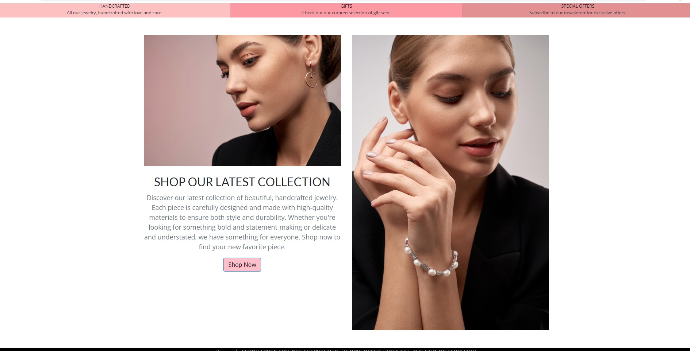
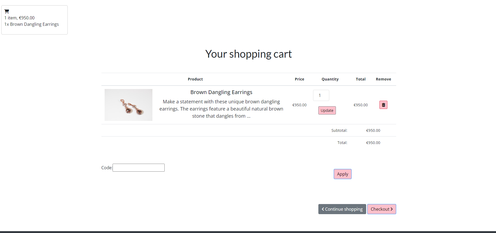

# old-town-jewels
# About
Old Town Jewels is an online jewellery store built using the Django web framework. It was developed as a part of a Fullstack course with Code Institute.

The store offers a wide variety of beautiful and unique jewellery pieces, including rings, earrings, necklaces, and more. Customers can browse the store's inventory, add items to their cart, and complete their purchase securely through the website.

Old Town Jewels is designed to be user-friendly and easy to navigate. The store features a clean and modern design, with high-quality product photos and detailed product descriptions to help customers make informed purchasing decisions.

Whether you're looking for a special piece of jewellery for yourself or a gift for someone else, Old Town Jewels has something for everyone. We hope you enjoy shopping with us!

 

[View the live project here](https://old-town-jewels.herokuapp.com/ "Link to deployed site - Old Town Jewels")


# Table of Contents

[User Experience](#user-experience)

- [Strategy](#strategy)

- [User Stories](#user-stories)

- [Scope](#scope)

- [Structure](#structure)
    - [Design](#design)
        - [Wireframes](#wireframes)
        - [Color Schema](#color-schema)
        - [Model Schema](#model-schema)

- [Marketing Strategies](#marketing-strategies)

- [Features](#features)

- [Technologies Used](#technologies-used)

- [Testing](#Testing)

- [Bugs Found](#bugs-found)

- [Deployment](#deployment)

- [Credit](#credit)

- [Acknowledgments](#Acknowledgments)


# User experience

At Old Town Jewels, our goal is to provide an enjoyable and seamless shopping experience for both our customers and the store owner. To achieve this, we have implemented the following strategies:

# Strategy
## For Customer
1. Easy navigation: We have designed the store's layout and menu to be intuitive and easy to use, so customers can easily find  what they are looking for.

2. Clear product descriptions: We have provided detailed descriptions of each product, including information on materials, sizing, and care instructions. This helps customers make informed purchasing decisions.

3. Secure checkout: We have implemented secure payment methods and encrypted data transmission to protect our customers' personal and financial information.

### What's New

4. User Profiles: Added User profiles for customers where they can modify their personal information, date of birth, name, email and also change a password.

5. Reviews: Added reviews on each product where customers can rate the product themselves and see the average rating of each product. Users are allowed to modify/delete their c omments.

6. User emails: Users are now getting emails after each completed order with their order summary, price and payment method.

## For Owner 
1. Easy inventory management: We have provided tools for the owner to easily add, update, and delete products from the store's inventory.

2. Detailed sales reports: The owner can access reports on sales data, including total revenue.

3. Track payments: The owner can track payments on the admin dashboard and print a csv file of each order if desired.

By following these strategies, we hope to create a positive user experience for our customers and encourage them to shop with us again in the future.

# User Stories
As the superuser of Old Town Jewels, I want to be able to:

1. **Add and manage products**: I want to be able to easily add new products to the store's inventory, as well as update and delete existing products.

2. **View and analyze sales data**: I want to be able to access detailed reports on sales data, including total revenue and popular products.

3. **Manage user accounts**: I want to be able to add, update, and delete user accounts, including customer and employee accounts.

4. **Manage orders**: I want to be able to view and manage orders, including marking orders as shipped and canceling orders if necessary.

5. **Create and manage coupons**: I want to be able to create and manage coupons, including setting expiration dates and usage limits, and track their usage.


By being able to perform these tasks, I can effectively manage and maintain the Old Town Jewels store.

As a shopper at Old Town Jewels, I want to be able to:

1. **Easily browse and search for products**: I want to be able to easily browse through the store's inventory and use section filters to find specific products.

2. **View detailed product information**: I want to be able to see photos of the products and read detailed descriptions, including information on materials, sizing, and care instructions.

3. **Add items to my cart and complete my purchase**: I want to be able to easily add items to my cart and complete my purchase securely through the website.

4. **Apply coupons to my order**: I want to be able to enter a coupon code at checkout and have the discount applied to my order.

### What's New

5. **Log in and see my profile**: I want to be able to log in to the website, visit my profile and modify personal details.

6. **Leave a review on the product, or check ratings of a product**: I want to be able to comment on a product, rate it and edit/delete the review. I want to see the average reviews of the selected product to help me bring a decision about buying.

7. **Receive an email after purchase**: I want to receive an email after completing a purchase with my order summary, payment method, the amount I paid.

By being able to perform these tasks, I can easily shop and make purchases at Old Town Jewels.


# Scope

# User Story 1: Easily browse and search for products
Customers can easily browse through the store's inventory and use search filters to find specific products.

# User Story 2: View detailed product information
Customers can view high-quality photos of the products and read detailed descriptions, including information on materials, sizing, and care instructions.

# User Story 3: Add items to my cart and complete my purchase
Customers can easily add items to their cart and complete their purchase securely through the website.

# User Story 4: Apply coupons to my order
Customers have the option to apply coupons to their orders at checkout by entering a coupon code.

### What's new
# User Story 5: User Profiles
Customers can log in and view their profile. Customers are allowed to modify personal information including a password reset on the profile. 

# User Story 6: Password Reset
Customers can request a password reset and get an email with a link for a password change in case of a forgotten password. 

# User Story 7: Reviews
Customers are allowed to leave reviews on all products with a star rating, modify the reviews/delete accordingly. Customers are allowed to see the average rating of each product to help them make a decision before making a purchase.

# User Story 8: Delivery
Customers are allowed to add a delivery charge on their order. 

# User Story 8: Payment Information
Customers are getting a detailed overview of their purchase after successfull payments. All information is also forwareded onto the email address provided earlier in the checkout. 

# Superuser

# User Story 5: Add and manage products
As the superuser of the store, I can easily add and manage products.

# User Story 6: View and analyze sales data
As the superuser of the store, I can view and analyze sales data, including total revenue and popular products.

# User Story 7: Manage user accounts
As the superuser of the store, I can manage user accounts, including customer and employee accounts. 

# User Story 8: View and analyze sales data
As the superuser of the store, I can access detailed reports on sales data, including total revenue and popular products.

# User Story 9: Manage user accounts
As the superuser of the store, I can add, update, and delete user accounts, .

# User Story 10: Manage orders
As the superuser of the store, I can view and manage orders, including marking orders as shipped and canceling orders if necessary.

# User Story 11: Create and manage coupons
As the superuser of the store, I can create and manage coupons, including setting expiration dates and usage limits, and track their usage.

By providing these features, Old Town Jewels aims to create a positive shopping experience for both customers and the store owner.


# Structure

This project is a web-based application designed to provide customers with an easy-to-use and user-friendly online shopping experience. The application is built for an online jewelry store called Old Town Jewels.

The homepage of the website is structured with the company's logo and a welcoming message that greets the user upon arrival. The page is designed to be visually appealing and provide easy navigation. At the top of the page, a clear and well-organized navigation bar is provided, which allows the user to log in or sign up for a new account.

Once the user has logged in, they are directed to their personal profile section, where they can modify their personal information, such as their name, address, and contact details. In addition, the user is also allowed to change their password while being logged in. This feature adds an extra layer of security and privacy to the user's account.

The customers can browse through the wide range of products available on the website. Each product is displayed with a detailed description, including the price, specifications, and features. Moreover, the website also displays the average ratings and reviews provided by previous customers, helping the users to make informed decisions while shopping.

The website also allows customers to leave their own comments and ratings for each product. This feature provides an opportunity for customers to share their experiences and feedback, which can help other users to make more informed decisions while shopping.

Old Town Jewels shop enables clients to add products to their cart, apply discount codes, go through the checkout process, and pay with a credit card. The checkout process is designed to be easy and straightforward, with clear instructions provided at each step.

After the payment has been successfully processed, the customer is greeted with a message containing their order information, payment method, last 4 digits of the card they used on checkout, payment ID, and date of purchase. The order information is also forwarded to their email for their reference.

Finally, the website also includes a fully functional 404 error page, which provides a user-friendly error message in case the user encounters any technical difficulties while using the website. This feature adds an extra layer of user experience and convenience to the website.

**The website is made of the following apps**:

1. MyShop
2. Users
3. Cart
4. Coupons
5. Orders
6. Payment
7. Shop
8. Delivery

## Design
In addition to the visually appealing and user-friendly design, the website was also built with functionality in mind. The navigation menu was strategically placed to make it easy for users to find the products they are looking for. The search bar is prominently displayed to allow users to quickly search for specific products.

To ensure a seamless user experience, the website was designed to be responsive, meaning that it can adapt to different screen sizes and devices, including desktops, laptops, tablets, and mobile phones. This was achieved through the use of fluid grids and flexible images, which allow the website to adjust to different screen sizes without sacrificing its overall design and functionality.

To maintain a cohesive appearance throughout the site, a limited color palette was used, with careful consideration given to the colors chosen. This helps to ensure that the site looks professional and visually appealing, without overwhelming the user with too many colors and distracting elements.

Overall, the website was designed with the user in mind, with the goal of creating a pleasant and intuitive shopping experience. The combination of a visually appealing design, user-friendly navigation, and responsive layout helps to achieve this goal, making the website an effective tool for selling products online.

- ## Wireframes
wireframes for the project were created using [Balsamiq](https://balsamiq.com/)

**Home Page**
Hero Image


Section 1


Section 2 


Section 3


Section 4 


The wireframes show that the homepage has a hero image at the top, which is a large banner that spans the full width of the page. The hero image is used to showcase the main message of the website and to grab the attention of the users.

Below the hero image, the wireframes show four different sections. The first section is an invitation to shop with the company, with some images of their products. This section is designed to encourage users to explore the website and make a purchase.

The second section is a carousel of the company's products. This section showcases the company's products in a visually appealing and dynamic way, allowing users to browse through the different products easily.

The third section is a big sale image, which is used to highlight any current sales or promotions that the company may be offering. This section is designed to catch the user's attention and encourage them to take advantage of the current sale.

Finally, the fourth section is a call to action for users to follow the company on Instagram. This section includes the company's Instagram logo and an image from their Instagram feed, encouraging users to follow the company's social media page for more updates and promotions.

Login Page 


A wireframe of a login page  onsists of a login form and an accompanying image or graphic that adds visual interest to the page. The login form includes input fields for the user's email and password, as well as additional features such as a checkbox to remember the user's login information and a link to reset a forgotten password.

The accompanying image or graphic is selected to convey the purpose and brand of the website. It is usually relevant to the website's content or theme and is intended to make the page visually appealing and engaging.

Overall, the wireframe for the login page is designed to be user-friendly and easy to navigate. A clear and well-designed login form is essential to ensure a positive user experience, while an accompanying image or graphic helps to enhance the overall visual appeal of the page.

Register Page 


User Profile


The user profile page is designed to provide users with the ability to modify their personal information. The page is built upon an HTML template that extends the base template of the website.

The user profile page includes a navigation bar at the top of the page, which displays the user's username and provides links to edit the user's profile or log out of the website. Additionally, the navigation bar also includes a link to the shop page.

The main content of the user profile page is contained within a card. The card displays the user's username and includes a form where the user can modify their personal information, such as their first name, last name, email, and date of birth.

The form includes input fields for each of the user's personal information, and a "Save Changes" button is provided to allow the user to save their modifications. Additionally, the user is provided with a link to change their password, in case they wish to update their login credentials.

Shop Page 


The shop page is designed to display the various products available for purchase on the website. The page is built on an HTML template that extends the base template of the website.

The shop page includes a navigation bar at the top of the page, which provides links to various pages on the website, including the user's profile page and the shopping cart. The title of the page is dynamic and changes depending on whether the user is viewing all products or a specific category of products.

The main content of the shop page is divided into two columns. The left column displays a list of product categories, allowing users to filter the products based on their preferences. The right column displays the products themselves, with a product image, name, description, and price.

Users can click on a product to view its details, including additional images, specifications, and reviews. Additionally, users can add products to their cart and proceed to checkout to make a purchase.


Product Detail Page


The product detail page provides users with detailed information about a specific product on the website. The page is built on an HTML template that extends the base template of the website.

The product detail page displays a large image of the product, along with its name, category, and price. A brief description of the product is also provided, along with a form that allows users to add the product to their shopping cart.

Below the product information, users can view any reviews that have been left for the product. The average rating of the product is also displayed, along with the total number of reviews.

Users can add a new review by filling out a form and submitting it. The form includes fields for the user's rating and comments. Users can also edit or delete their own reviews if they are logged in. 

The product detail page is designed to provide users with all the information they need to make an informed purchase decision. It allows users to view the product from multiple angles, read reviews from other customers, and add the product to their shopping cart with ease.

Cart Detail Page


The cart detail page displays the items that the user has added to their shopping cart. The page features a table that shows the product name, price, quantity, and total price for each item in the cart. The user has the option to update the quantity or remove the item from the cart. The page also displays the subtotal and total price of all the items in the cart, including any discounts applied from a coupon code. There is a form at the bottom of the page where the user can apply a coupon code. The user can continue shopping or proceed to checkout from this page.

Order summary


The Order Summary page is a page that provides users with a detailed overview of their purchase before proceeding to payment. The page features a simple, easy-to-read layout with a prominent header, clear product images, and concise product information including name, price, and quantity. The table format allows for easy comparison of individual product costs and the subtotal, discount, and total costs are clearly displayed at the bottom. The "Pay now" button is located prominently at the bottom of the page, encouraging users to complete their purchase

Checkout Form


The Checkout form wireframe is a user interface that enables customers to input their personal and shipping information when placing an order. The form is divided into two sections, personal information and shipping information, and has several input fields for each section.

In the Personal Information section, customers are required to provide their first and last name and email address. The shipping information section has input fields for shipping country, postal code, address line 1 and 2, city and phone number. The form also includes an order summary section that displays the items in the customer's cart, the price of each item, the quantity, and the total price after discount (if any).

At the bottom of the form, there is a "Submit" button that customers can use to submit their information to complete the order. The form also includes a CSRF token to ensure the security of the submission.

Payment Form


Description: This page displays the payment form where the user can enter their credit or debit card information and billing address. The form includes the following fields:

- Name on the card
- Credit or debit card
- Billing information:
- Address 1
- Address 2 (optional)
- Postal code
- City
- Country
- Checkbox for copying shipping address
- Delivery option (if available)
Order summary table showing the product name, quantity, price, and total amount
Coupon code applied (if any)
Delivery charge
Total amount to be paid
The user must fill in all the required fields to proceed with the payment. Once the form is submitted, the payment will be processed and the user will be redirected to the payment confirmation page.


Payment Confirmation


The payment confirmation template includes blocks for the title, subheader, and content. The content block includes a card with two columns. The left column displays the order summary, including the products, quantities, prices, coupon code (if applicable), delivery charge, and total cost. The right column displays the payment details, including the email, payment method, transaction ID, and date of payment. The payment confirmation template uses custom filters to display the total price of each item.


- ## Color Schema

The colors #111111, #444444, and #333333 are shades of gray, with #111111 being the darkest and #333333 being the lightest. These colors give a sense of professionalism and sophistication, and can be used as a background or text color to create a clean and simple layout.

#ffc0cb is a shade of pink, which is often associated with warmth, playfulness, and femininity. It can be used as an accent color to add a pop of color to the layout without overwhelming the design.

#ffffff is pure white, which can be used as a background color to create a clean and modern look. It can also be used as a text color for areas where high contrast is needed, such as on dark backgrounds.

Overall, using these colors I achieved a simple and clean layout that allows the products to be the focal point.

- ## Model Schema
Our application uses two different databases: SQLite for local development and Postgres for the deployed app on Heroku. SQLite is a lightweight, file-based database that is easy to set up and use for development purposes. Postgres is a more powerful and feature-rich relational database that is well suited for production environments.

For local development, we use SQLite as the database. SQLite is included in Python's standard library and requires no additional setup.

For the deployed app on Heroku, we use Postgres as the database. Postgres is a powerful, open-source relational database that is well suited for production environments. It offers robust data integrity and security features, as well as advanced performance and scalability.

We have created a separate data model for each of the databases, which defines the tables, fields, and relationships used in the application. The data model for SQLite is designed for local development and is optimized for ease of use and rapid development. The data model for Postgres is designed for production and is optimized for performance, scalability, and data integrity.

To set up the databases, you will need to install SQLite and Postgres on your local machine and configure the appropriate settings in the application's configuration file. Once the databases are set up, you can use any SQL client to interact with the databases, such as the SQLite command-line tool or pgAdmin for Postgres.

Keep in mind that SQLite is file-based while Postgres is server-based, so you will have to configure the appropriate settings in the application's configuration file to connect the app to the right database depending on the environment, local or production.

Please note that the SQLite database will be created automatically when you run the application for the first time in local environment and the Postgres database should be created manually in Heroku before you deploy your app.

**Product Models**
- **orders app**
The **Order** model has a one-to-many relationship with the **OrderItem** model, as defined by the ForeignKey field in the **OrderItem** model that references the **Order model**. The **Order** model also has a foreign key relationship with the **Coupon** model, which is a one-to-many relationship where one coupon can be used in multiple orders. The **Order** model has a get_total_cost_before_discount method that sums the cost of all associated **OrderItem** objects and a get_discount method that calculates a discount based on the discount field and the total cost before discount. The **Order** model also has a method get_stripe_url that returns a Stripe URL based on the stripe_id field. The **OrderItem** model has a one-to-one relationship with the **Product model**, as defined by the ForeignKey field in the **OrderItem** model that references the **Product model**, and it also has a method get_cost that calculates the cost of the item by multiplying the price and quantity fields.
- **shop app**
The **Category** model has a one-to-many relationship with the **Product model**, as defined by the ForeignKey field in the **Product** model that references the **Category model**. This means that one category can have multiple products associated with it. The **Category** model has a get_absolute_url method that returns the URL of a page that displays all products of that category. The **Product** model has a name, slug, image, description, price, available, created, and updated fields and a get_absolute_url method that returns the URL of the product detail page. Additionally, the **Product** model has a Meta class that contains the indexes, ordering and other metainformation about the model.

**DeliveryOption model**: This model represents the delivery options available for the products. It has a name field that specifies the name of the delivery option, and a price field that specifies the delivery price. The price is stored as a decimal number with a maximum of 6 digits and 2 decimal places.

**Profile model**: This model represents the user profile. It has a one-to-one relationship with the built-in User model in Django, as specified by the OneToOneField. The profile contains additional information about the user, such as their date of birth and alternate contact information. It has a get_absolute_url method that returns the URL of the user's profile detail page.

**Review model**: This model represents the product reviews submitted by users. It has a foreign key relationship with the Product model, as defined by the ForeignKey field that references the Product model. It also has a foreign key relationship with the built-in User model in Django, as specified by the ForeignKey field that references the AUTH_USER_MODEL. The model includes a body field that contains the review text, a rating field that specifies the rating given by the user, and created and updated fields that record the date and time the review was created or last updated. The active field is a Boolean field that indicates whether the review is currently active or not. The Review model also has a Meta class that specifies the ordering and indexing options for the model.

# Marketing Strategies

In order to drive more traffic to the website and attract potential customers, the following marketing strategies have been employed:

1. Social Media Marketing: Three major social media platforms (Facebook, Instagram, Twitter) have been utilized to reach out to a wider audience and increase brand awareness. Regular posts, promotions, and interactive content have been shared to engage with the followers.

2. Search Engine Optimization (SEO): The website has been optimized for search engines to improve its visibility and ranking. This includes the implementation of a sitemap.xml file and robots.txt file, as well as the use of relevant keywords in the website's content and meta description.

3. Email Marketing: An email list has been created to send out newsletters, promotions, and other relevant updates to the subscribers.

By implementing these marketing strategies, the website aims to attract more customers and increase sales.

1. **Social Media Marketing** 

[Facebook](https://www.facebook.com/people/Old-Town-Jewels/100089850577128// "Facebook Link")
On Facebook, a business page for Old Town Jewels is created and used to showcase our products, 
share promotions and discounts, and interact with our customers.

[Instagram](https://www.instagram.com/ot__jewels/ "Instagram Link")
On Instagram, we plan to create a visually appealing account that highlights our products, showcases our brand, 
and shares customer reviews and testimonials.

[Twitter](https://twitter.com/old_townjewels "Twitter Link")
On Twitter, we plan to use Twitter to share updates about new products, promotions, and events, as well as respond to customer inquiries and feedback.

2. **SEO** 

**Keyword research**: To determine the most relevant and high-traffic keywords for this website
I made a list of important topics based on the type of the website and targeted users and researched related search terms. I used a keyword research tool
[Ahrefs](https://ahrefs.com/keywords-explorer)

**Technical SEO**: Technical optimizations I made to improve the crawlability and indexability of this site
Adding a sitemap.xml and robots.txt file and ensuring the site is mobile-friendly, using bootstrap for layouts and testing responsivness with Google Responsive Tools.

A website's essential pages are listed in an XML sitemap file so that Google can easily identify and crawl them individually. Additionally, it aids in the structure-understanding of search engines. The discovery of content is sped up with a sitemap. All the URLs on website that a search engine crawler may visit are specified in a robots.txt file. The rules are assigned to bots by stating their user-agent (the search engine bot) followed by directives (the rules). I have allowed all search engines to crawl this entire site. Thereafore my block looks like this:

```
User-agent: *
Allow: /
```

Meta tag in the HTML code, is used to provide a brief description of the website that may be displayed in search results
```
meta name="description" 
```

**Analytics and tracking** : In the future the plan to track and measure the success of SEO efforts, Google Analytics service will be set up. Google Analytics includes features that can help users identify trends and patterns in how visitors engage with their websites. Features enable data collection, analysis, monitoring, visualization, reporting and integration with other applications. 

**Continuous improvement**: Regular reexamination of ongoing SEO efforts is of big importance. Strategies should be continually monitored and updated  based on changing search algorithms and user behavior.

3. **Email Marketing**

Users are able to easily subscribe to the monthly newsletter at the bottom of the site. 

# Features

Landing Page





Log in 


Register


Edit Profile


Change Password


Forgotten password


Shop Products


CRUD Reviews


Shopping Cart




Checkout and Payment


# Technologies Used

### Languages Used

-   [HTML5](https://en.wikipedia.org/wiki/HTML5)
-   [CSS3](https://en.wikipedia.org/wiki/Cascading_Style_Sheets)
-   [JavaScript](https://en.wikipedia.org/wiki/JavaScript "Link to JavaScript Wiki")
-   [Python](https://en.wikipedia.org/wiki/Python_(programming_language))

## Frameworks - Libraries - Programs Used
- [Django](https://www.djangoproject.com/)
- [Django-allauth](https://django-allauth.readthedocs.io/en/latest/installation.html)
- [ElephantSQL](https://www.elephantsql.com/)
- [Heroku](https://dashboard.heroku.com/login)
- [Google Fonts](https://fonts.google.com/ "Link to Google Fonts")
- [Celery](https://docs.celeryq.dev/en/stable/)
- [RabbitMQ](https://www.rabbitmq.com/)

# Testing

## Index – Table of Contents

* [Manual Testing](#manual-testing) 
* [User Stories Testing](#user-stories-testing)
* [Responsiveness Testing](#responsiveness-testing)
* [HTML Testing](#html-testing)
* [CSS Testing](#css-testing)
* [Lighthouse Testing](#lighthouse-testing)


## Manual Testing

## Testing

### Login Functionality

**What the page is supposed to do:** The login page should allow users to enter their credentials and log in to the website. After logging in, they should be redirected to the home page.

**What we observed:** We tested the login functionality by entering valid and invalid credentials. We observed that when we entered valid credentials, we were redirected to the home page as expected.

### Shopping Cart Functionality

**What the page is supposed to do:** The shopping cart page should display all the items that the user has added to their cart and allow them to update or remove items as needed. The page should also display the total cost of the items in the cart.

**What we observed:** We tested the shopping cart functionality by adding and removing items to the cart and updating the quantity of items in the cart. We observed that the cart updated correctly and displayed the correct total cost of the items.

### Checkout Functionality

**What the page is supposed to do:** The checkout page should allow users to enter their personal and shipping information, as well as any coupon codes they have. The page should also display a summary of the user's order and the total cost.

**What we observed:** We tested the checkout functionality by entering valid and invalid information. We observed that when we entered valid information, we were able to submit the form and were redirected to the payment page. However, when we entered invalid information, the form did not submit and we were shown error messages.

### Payment Functionality

**What the page is supposed to do:** The payment page should allow users to enter their credit card information and billing address, as well as select a delivery option. After submitting the form, users should be shown a confirmation page with the details of their order and payment.

**What we observed:** We tested the payment functionality by entering valid and invalid information. We observed that when we entered valid information, we were able to submit the form and were redirected to the confirmation page. However, when we entered invalid information, the form did not submit and we were shown error messages.

## Troubleshooting 

Scenario 1: Adding a product to the cart
  - User navigates to the product page
  - User selects the quantity and clicks "Add to cart"
  - The product is successfully added to the cart
  - Expected behavior: The cart icon in the navbar shows the number of items in the cart

Scenario 2: Applying a coupon code
  - User navigates to the cart page
  - User enters a valid coupon code and clicks "Apply"
  - The discount is applied to the total price
  - Expected behavior: The total price reflects the discount and the coupon code is shown in the order summary

Scenario 3: Removing a product from the cart
  - User navigates to the cart page
  - User clicks the "Remove" button next to a product
  - The product is successfully removed from the cart
  - Expected behavior: The total price and the number of items in the cart are updated

Scenario 4: Updating the quantity of a product in the cart
  - User navigates to the cart page
  - User changes the quantity of a product and clicks "Update"
  - The quantity is successfully updated in the cart
  - Expected behavior: The total price and the number of items in the cart are updated

**Error**: When the user is adding a product to the cart, the quantity is not being updated.

**Solution**: After checking the Cart model, it was found that the add_product method was not updating the quantity when the product is already in the cart. This was fixed by updating the add_product method to increase the quantity when the product is already in the cart.
  
Scenario 5: Completing the checkout process
  - User navigates to the checkout page
  - User enters their personal and shipping information
  - User enters their payment information and clicks "Pay"
  - The payment is successfully processed and the order is created
  - Expected behavior: The user is redirected to the payment confirmation page and receives an email confirmation

**Error**: When the user submits the checkout form, the email is not being saved.

**Solution**: It was found that the email field was not added in the Order model. After adding the email field in the Order model and updating the checkout view to save the email, the email started being saved.

Scenario 6: Updating user profile information

- User logs in to their account
- User navigates to their profile page
- User updates their personal information such as their email address, password, or date of birth
- User clicks the "Save Changes" button
- If the form is valid, the changes are saved and the user is redirected to their updated profile page
- If there are errors in the form, the user is shown an error message and asked to correct the fields with errors

Scenario 7: Adding a new product to the website

- Admin logs in to the website admin panel
- Admin navigates to the "Products" section and clicks "Add Product"
- Admin enters the product information such as name, description, and price
- Admin uploads product images and assigns categories and tags to the product
- Admin clicks "Save" to create the new product
- The new product is added to the website and is visible to users on the product listing page

Scenario 8: Editing an existing product on the website

- Admin logs in to the website admin panel
- Admin navigates to the "Products" section and selects the product they want to edit
- Admin makes changes to the product information such as name, description, or price
- Admin uploads new product images or deletes existing ones
- Admin clicks "Save" to update the product
- The updated product information is reflected on the website and visible to users who view the product page

Scenario 9: Deleting a product from the website

- Admin logs in to the website admin panel
- Admin navigates to the "Products" section and selects the product they want to delete
- Admin clicks the "Delete" button and confirms that they want to delete the product
- The product is removed from the website and is no longer visible to users on the product listing page


## Code Testing 

The Python code was tested using the Code Institute's PEP8 linter to ensure compliance with Python coding standards.
The linter was configured to report errors and warnings for all files in the project.
The linter was run before committing any changes to the codebase to ensure that no new issues were introduced.
All reported issues were reviewed and fixed as necessary to ensure clean, readable code.

## Cart App

cart.py


context_processors.py


forms.py


urls.py


views.py


## Coupons App

admin.py


apps.py


forms.py


models.py


urls.py


views.py


## Delivery App

admin.py


apps.py


models.py


## Myshop App

urls.py


views.py


## Orders App

admin.py


apps.py


forms.py


models.py


urls.py


views.py


## Payment App

apps.py


forms.py


urls.py


views.py


## Shop App

admin.py


apps.py


form.py


models.py


urls.py


views.py


## Responsivness Testing

The app has been tested in Chrome with developer tools and showed to be fully responsive.

## HTML Testing


| HTML document             | Result | Issues found                                                            | Fixes made                                                                  |
|---------------------------|--------|-------------------------------------------------------------------------|-----------------------------------------------------------------------------|
| base.html                 | Fail   |1. Stray start tag <script>.                                             |1. Checked for script closed tags and invisible characters and whitespaces   |
| index.html                | Pass   |                                                                         |                                                                             |
| login.html                | Fail   |1. Unclosed element div                                                  |1. Close div element                                                         |
| logout.html               | Pass   |                                                                         |                                                                             |
| register.html             | Pass   |                                                                         |                                                                             |
| detail.html               | Fail   |1. Element div not allowed as child of element ul in this context.       |1. Wrap div element in li element                                            |
| list.html                 | Pass   |                                                                         |                                                                             |
| newsletter.html           | Pass   |                                                                         |                                                                             |
| cart/detail.html          | Fail   |1. Element div not allowed as child of element button in this context.   |1. Remove a element                                                          |
| payment-successfull.html  | Pass   |                                                                         |
| payment-unsuccessfull.html| Pass   |                                                                         |

# CSS Testing 

<p>
    <a href="http://jigsaw.w3.org/css-validator/check/referer">
        
    </a>
</p>

# Lighthouse Testing 

Desktop Testing with Google Lightouse


Mobile Testing with Google Lighthouse


## Bugs Found

### Criterion 1.2
- **Issue:** Insufficient feedback is relayed to the user in the event of successful and failed payment attempts. Confirmation e-mails are not sent on successful purchases.
- **Status:** Fixed

## Changes Made
### Criterion 1.2
- Added payment information on the payment_completed page after a successful payment.


- Improved feedback to users on payment attempts by displaying relevant information such as payment method, transaction ID, and date. 

- Added email functionality using SMTP to send confirmation emails to users on successful purchases.


# Deployment

## Deploying-on-Heroku

To deploy this project on Heroku, the following steps were taken:

1. Create a new app on Heroku and choose a name and location for it.
2. In the Resources tab, add a Postgres database to the app by selecting the "Heroku Postgres" option under add-ons.
3. In the Settings tab, reveal the Config Vars and copy the url next to DATABASE_URL.
4. In the project's GitPod workspace, create an env.py file and add the DATABASE_URL and SECRET_KEY values to it.
5. Update the project's settings.py file to import the env file and add the SECRET_KEY and DATABASE_URL file paths.
6. Update the Config Vars with the Cloudinary URL, and also update the settings.py file with this URL.
7. In the settings.py file, add Cloudinary to the INSTALLED_APPS list, and add values for STATICFILE_STORAGE, STATICFILES_DIRS,   
   STATIC_ROOT, MEDIA_URL, DEFAULT_FILE_STORAGE, and TEMPLATES_DIR.
8. Update the DIRS in TEMPLATES with the TEMPLATES_DIR value, and update ALLOWED_HOSTS with ['app_name.heroku.com', 'localhost'].
9. Create media, storage, and templates directories in the main project directory, and add a Procfile with the following content: "web: gunicorn project-name.wsgi".
10. Log in to Heroku using the terminal and run the command "heroku git:remote -a your_app_name_here" to link the app to the GitPod workspace.
11. To deploy new versions of the app, run the command "git push heroku main" in the terminal

## Forking the Repository

1. Make sure you have a GitHub account. If you don't have one, you can create an account by going to https://github.com and following the prompts.
2. Go to the GitHub page for the repository you want to fork.
3. In the top right corner of the page, click the "Fork" button. This will create a copy of the repository in your account.
4. You can then clone the repository to your local machine by following the steps in the "Creating a clone" section above, replacing USERNAME with your own GitHub username and REPOSITORY with the name of the repository.
5. Once you have a copy of the repository on your local machine, you can make changes to it and commit those changes back to your fork on GitHub. You can also create a pull request to submit your changes to the original repository for review.

It's generally a good idea to keep your fork up to date with the original repository by regularly syncing your fork with the upstream repository. To do this, you can add the original repository as an upstream repository and then use the git pull command to sync your fork with the upstream repository.

## Creating a clone

1. Make sure you have Git installed on your local machine. You can check if you have it installed by running the command git --version in your terminal.
2. Navigate to the directory where you want to create a copy of the repository.
3. Run the command git clone https://github.com/USERNAME/REPOSITORY.git, replacing USERNAME with the username of the repository owner and REPOSITORY with the name of the repository. In this specific case (https://github.com/marosan28/old-town-jewels.git) This will create a copy of the repository in a new directory with the same name as the repository.
4. Change into the new directory by running the command cd REPOSITORY, replacing REPOSITORY with the name of the repository.
5. Run the command git branch to see a list of available branches in the repository.
6. To switch to a specific branch, run the command git checkout BRANCHNAME, replacing BRANCHNAME with the name of the branch you want to switch to.


# Credits

## Content 

For finding website content I was using [Google](https://www.google.com)

## Media
For creating the website logo I used [Canva](https://www.canva.com/hr_hr/)

# Acknowledgments

- Special thanks to Antonio Mele the creator of the book Django 4 By Example - Fourth Edition 
- Python crash course book by Eric Matthes
- Slack community
- Tutor support
